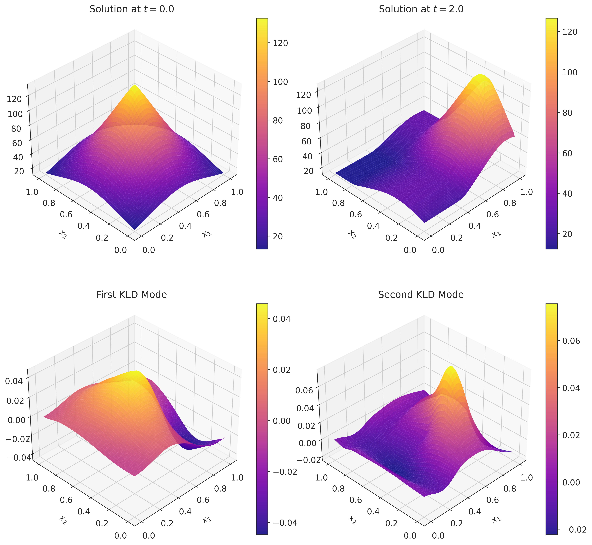
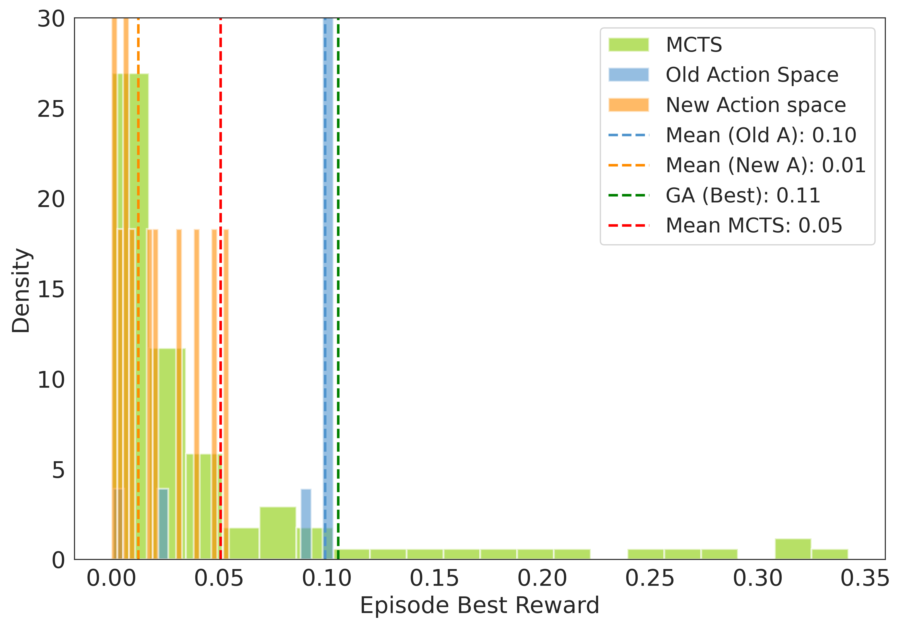
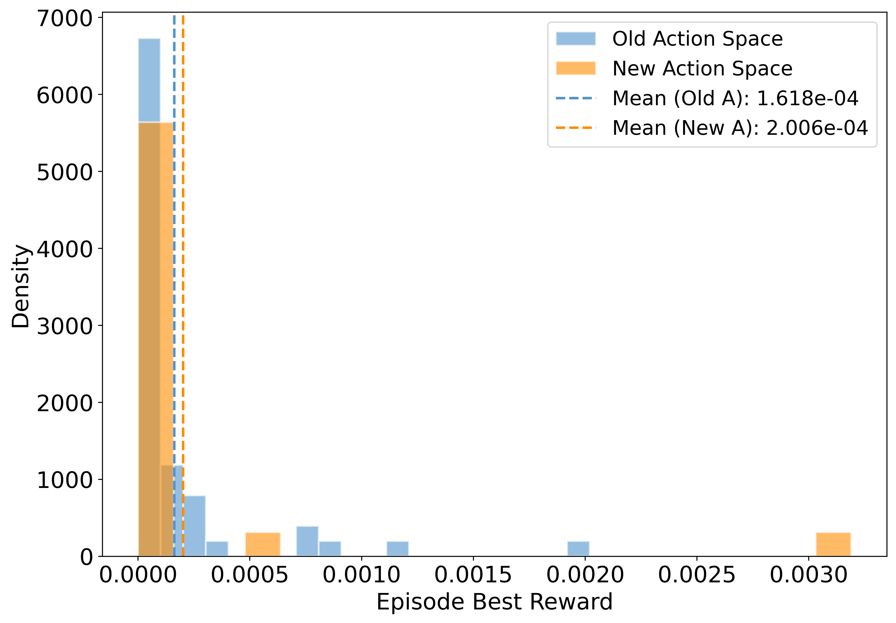
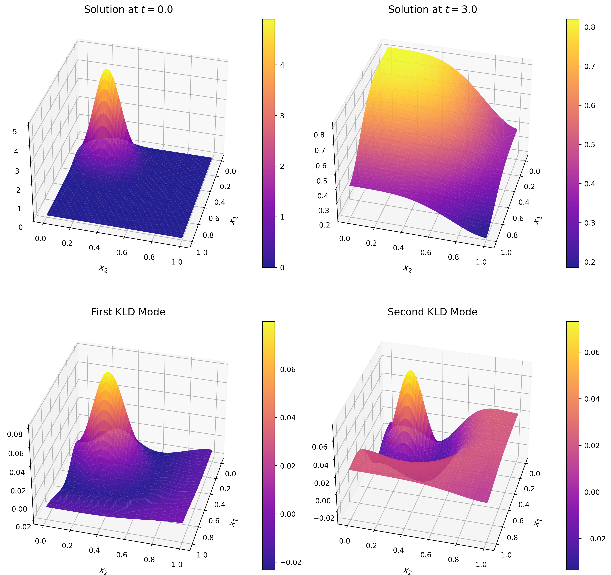

# Optimal Experimental Design using Reinforcement Learning

This repository contains the code and results for a project investigating the use of Reinforcement Learning (RL) for solving the Optimal Experimental Design (OED) problem in spatiotemporal models. The project explores the application of **Deep Q-Learning (DQN)** and **Monte Carlo Tree Search (MCTS)** to determine optimal sensor placements for parameter estimation.

## Project Overview

Optimal Experimental Design (OED) is crucial for effective parameter estimation, especially when data collection is expensive or noisy. Traditional optimization methods face computational challenges in high-dimensional settings due to the combinatorial complexity of OED. This project builds upon prior work that used Temporal Difference (TD) learning for OED by implementing and evaluating DQN with experience replay and fixed Q-targets to improve scalability and generalization. Additionally, the project frames the OED problem as a single-player game and investigates the use of MCTS.

The study compares two action space formulations for DQN:

* **Old action space (Aold):** Allows a selected sensor to move to any empty location on the grid in a single step.
* **New action space (Anew):** Restricts sensor movement to adjacent empty grid cells.

The performance of DQN with both action spaces is benchmarked against **Genetic Algorithms (GA)** on three different two-dimensional Distributed Parameter Systems (DPS):

* Advection equation
* Inviscid Burgers equation
* Advection-Diffusion-Reaction system

The project utilizes **Karhunen-Loève decomposition (KLD)** to reduce the dimensionality of the spatiotemporal systems while retaining dominant dynamics. The reward function for the RL agents is defined based on maximizing the determinant of a matrix related to the observability of the system, which minimizes the reconstruction error.

## Results

### Advection Equation

**Figure 1: Temporal evolution of the state u(x, t) for the advection equation and the corresponding first two KLD modes.**

**Figure 2: Distribution of reward using MCTS, DQN with old and new action spaces, and GA for the advection equation system.**

### Inviscid Burgers Equation

**Figure 3: Temporal evolution of the state u(x, t) for the inviscid Burgers equation and the corresponding first two KLD modes.**

**Figure 4: Distribution of reward using DQN with old and new action spaces and GA for the inviscid Burgers equation system.**

### Advection-Diffusion-Reaction System

**Figure 5: Temporal evolution of the state u(x, t) for the advection-diffusion-reaction system and the corresponding first two KLD modes.**

## Key Findings

* **Advection equation**:  
  * DQN with large sensor jumps achieves rewards comparable to GA.  
  * DQN with adjacent-cell movement struggles with instability.  
  * MCTS shows potential but suffers from inconsistent performance.  

* **Inviscid Burgers equation**:  
  * Both DQN variants underperform GA.  
  * Performance degradation likely due to discontinuities in the solution space.  

* **Advection-diffusion-reaction system**:  
  * Large-jump DQN outperforms adjacent-cell DQN.  
  * Both methods fall short of GA.  
  * Instability attributed to complex features.  
